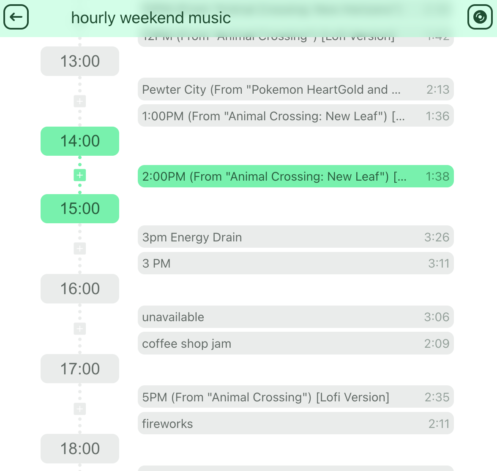

# music-schedule

> [!WARNING]
> This is mostly a POC and not a finished product so there are many bugs and missing features.

A one-week hobby project to play songs according to a schedule using the Spotify API.

> [!WARNING]
> This app itself only helps with creating a schedule and syncing the playback according to the schedule.

The playback, adding new songs, creating new playlists, etc. is all done through the Spotify app.

> [!IMPORTANT]
> This only works with a Spotify Premium account.

## Usage

1. Access the service at [https://music-schedule.simonschlegl.com](https://music-schedule.simonschlegl.com).
2. Login with your Spotify Premium account.
3. In the playlist selection menu, select a playlist. (You can only add schedules for playlists you own.)
4. Start playback on any device.
5. Press the sync button in the top right corner to sync the playback according to the schedule.

## Available Scripts

In the project directory, you can run:

### `npm start`

Runs the app in the development mode.\
Open [http://localhost:3000](http://localhost:3000) to view it in the browser.

The page will reload if you make edits.\
You will also see any lint errors in the console.

### `npm run build`

Builds the app for production to the `build` folder.\
It correctly bundles React in production mode and optimizes the build for the best performance.

The build is minified and the filenames include the hashes.\
Your app is ready to be deployed!